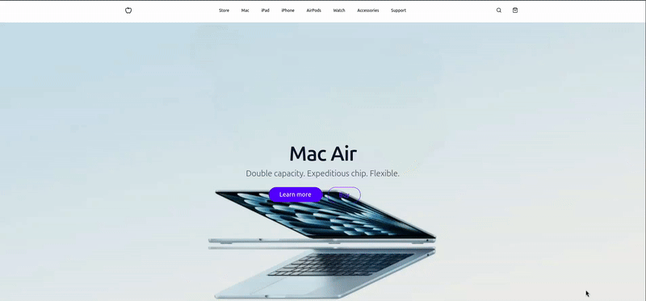
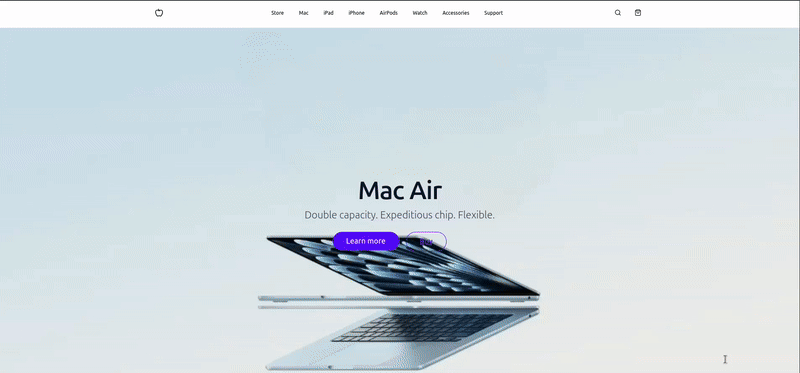
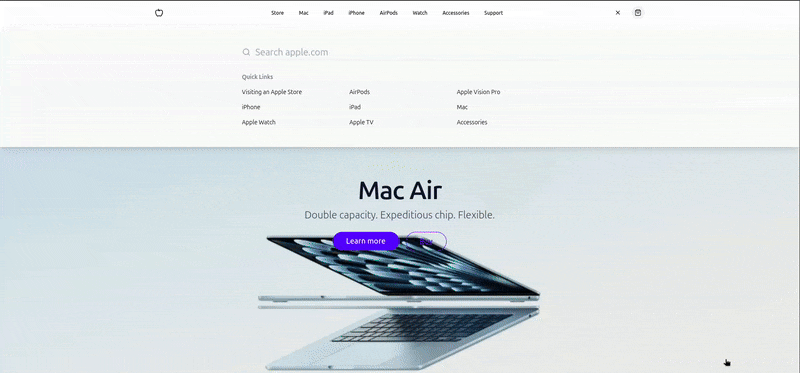
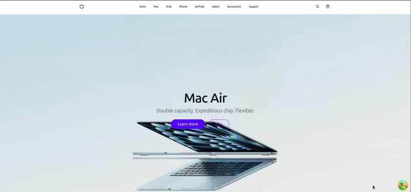
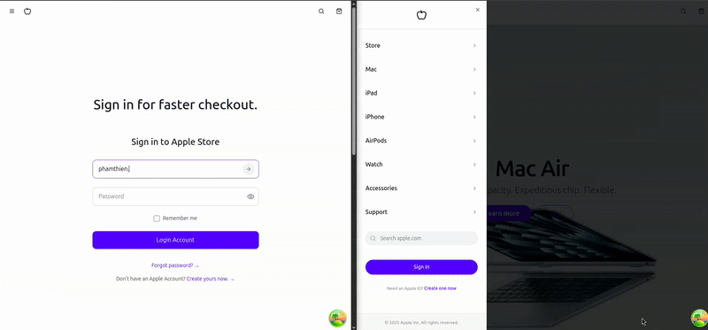
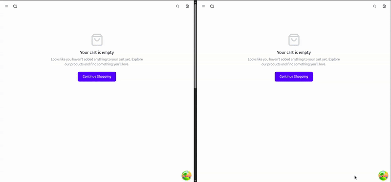

# Apple Store - MERN Stack E-commerce Platform

<div align="center">

⭐ **If you like this project, please star the repository!** ⭐ <br>
------- 👇 **Live Demo Below** 👇 --------

<hr>
</div>

<div align="center">
<a href="https://github.com/yourusername/apple-store" target="blank">

</a>

<h2>Modern Apple Products E-commerce Platform</h2>


</div>

## 💡 Overview

A comprehensive e-commerce platform for Apple products built with the MERN stack (MongoDB, Express, React, Node.js). It offers a seamless shopping experience with real-time cart updates via WebSockets, secure payment processing with Stripe (including asynchronous order management via webhooks), and a responsive, optimized design for all devices.

## 🎬 Demo

**🔐 Seamless User Authentication**

- **Register and verify users effortlessly**

  

- **Verify email flow (user must be verified for payment checkout)**

  

- **Secure password reset flow**

  

**🛒 Smooth Shopping Experience**

- **Interactive product ordering**

  

- **Real-time cart management**

  

- **Real-time cart syncing**

  

## ✨ Features

- **🛒 Real-time Shopping Cart:** Instant updates using WebSockets
- **💳 Secure Checkout:** Integration with Stripe payment gateway
- **👤 User Authentication:** JWT-based secure authentication system
- **📱 Responsive Design:** Optimized for all device sizes
- **🔍 Product Search & Filtering:** Advanced search capabilities
- **🚚 Order Tracking:** Real-time order status updates
- **👨‍💼 Admin Dashboard:** Comprehensive product and order management
- **🔒 Secure API:** Protected endpoints with proper authorization

## 👩‍💻 Tech Stack

### Frontend

- **React 18:** Modern UI library with hooks and suspense
- **TypeScript:** Type-safe development
- **Vite:** Next-generation frontend tooling
- **TanStack Query:** Data fetching and state management
- **Tailwind CSS:** Utility-first styling
- **Shadcn UI:** Accessible component library
- **React Hook Form:** Form validation and handling
- **Socket.io Client:** Real-time communication

### Backend

- **Express.js:** Fast, unopinionated web framework
- **MongoDB:** NoSQL database with Mongoose ODM
- **Socket.io:** Real-time bidirectional event-based communication
- **JWT:** Secure authentication
- **Stripe:** Payment processing
- **Nodemailer:** Email notifications

### DevOps

- **Docker:** Containerization
- **Kubernetes (Helm):** Container orchestration
- **GitHub Actions:** CI/CD pipeline
- **Terraform:** Infra as Code (IAC)

## 📦 Getting Started

### 🚀 Prerequisites

- Node.js (v18.x or higher)
- MongoDB
- Docker (optional for containerization)

### 🛠️ Installation

1. **Clone the repository:**

   ```bash
   git clone git@github.com:Bas3L3ss/apple-store.git
   cd apple-store
   ```

2. **Set up environment variables:**

   Create `.env` files in the server directory: or Secret.yml

   ```env
   # server/.env
   PORT=5000
   MONGO_URI=mongodb+srv://your-connection-string
   JWT_SECRET=your-secret-key
   STRIPE_SECRET_KEY=your-stripe-key
   STRIPE_WEBHOOK_SECRET=your-webhook-secret
   ```

3. **Install dependencies and start the application:**

   ```bash
   # Install server dependencies
   cd server
   npm install

   # Install client dependencies
   cd ../client
   npm install

   # Install websocket dependencies
   cd ../websocket
   npm install

   # Start the development servers
   # In separate terminals:
   # Terminal 1 (server)
   cd server
   npm run dev

   # Terminal 2 (client)
   cd client
   npm run dev

   # Terminal 3 (websocket)
   cd websocket
   npm run dev
   ```

4. **Using Docker (optional):**
   ```bash
   docker-compose up
   ```

## 🚢 Deployment

### Using Kubernetes

1. **Apply Kubernetes manifests:**

   ```bash
   kubectl apply -f infrastructure/client
   kubectl apply -f infrastructure/server
   kubectl apply -f infrastructure/websocket
   ```

2. **Access the application:**

   ```bash
   kubectl get services
   ```

## 📖 Usage

Visit `http://localhost:5173` to access the application. Create an account to:

- Browse Apple products by category
- Add items to your cart in real-time
- Manage your user profile
- Complete purchases with Stripe
- Track your order status
- Leave product reviews

## 🤝 Contributing

1. Fork the repository
2. Create your feature branch (`git checkout -b feature/AmazingFeature`)
3. Commit your changes (`git commit -m 'Add some AmazingFeature'`)
4. Push to the branch (`git push origin feature/AmazingFeature`)
5. Open a Pull Request

## 📜 License

This project is licensed under the MIT License - see the [LICENSE](LICENSE) file for details.

## 🚀 Future Roadmap

- **🔍 Enhanced SEO:** Improve metadata for all pages
- **📊 Analytics Dashboard:** Comprehensive sales and user metrics
- **🌐 Internationalization:** Multi-language support
- **📱 Mobile App:** Native mobile experience with React Native
- **🤖 AI-Powered Recommendations:** Personalized product suggestions
- **🔐 Enhanced Security:** Two-factor authentication
- **📦 Inventory Management:** Real-time stock tracking
- **🎯 Targeted Marketing:** Email campaigns and promotions
